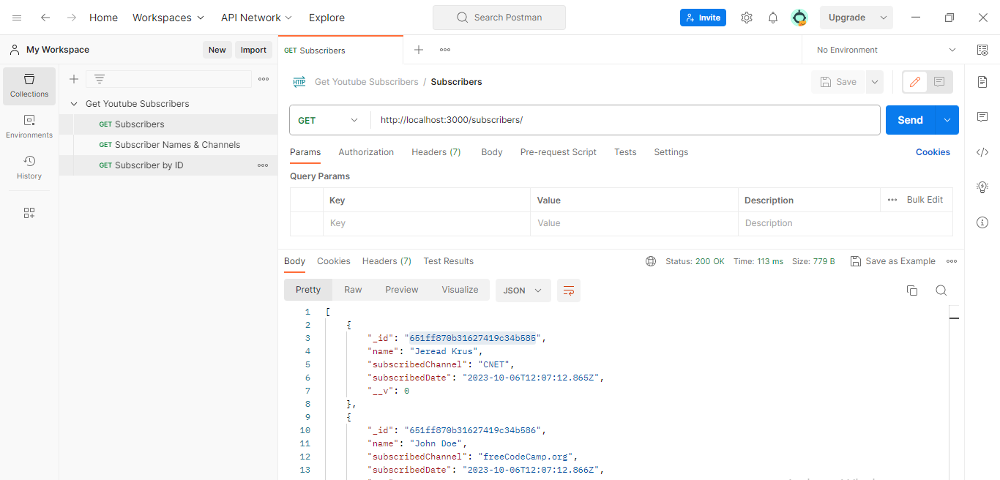
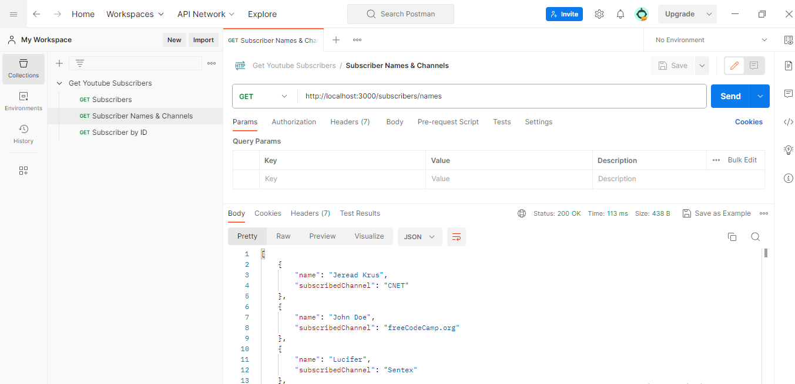
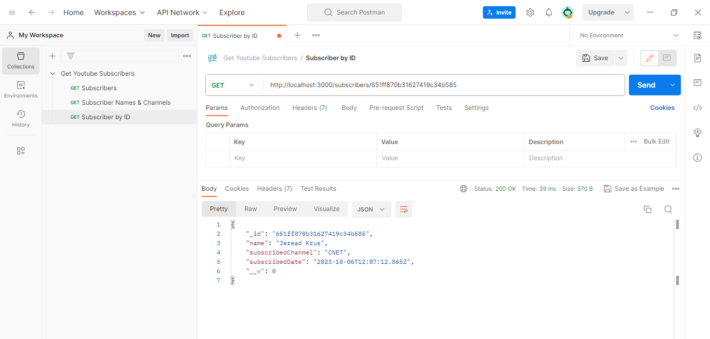
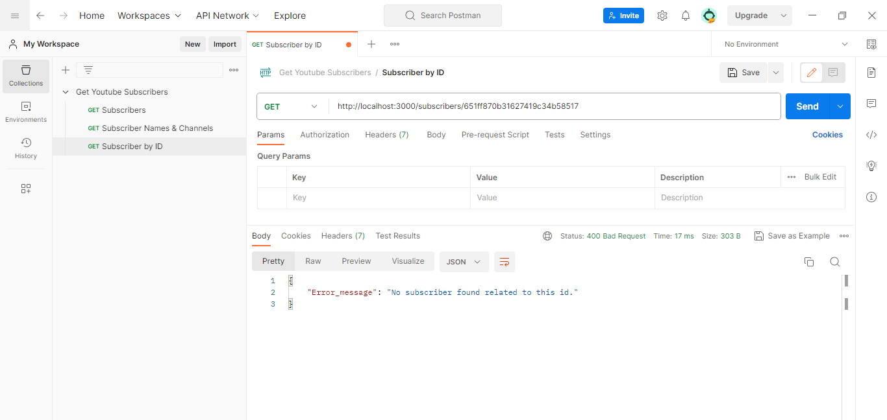

# YouTube Subscribers App API Documentation

This documentation provides details about the API endpoints available in the YouTube Subscribers App.

## Base URL

The base URL for all API endpoints is: 
http://localhost:3000

## Endpoints

### Get All Subscribers

- **Endpoint:** `/subscribers`
- **HTTP Method:** GET
- **Description:** Retrieve a list of all subscribers.
- **Response Format:** JSON Array

#### Example Request 

GET http://localhost:3000/subscribers

### Get Subscriber Names

- **Endpoint:** `/subscribers/names`
- **HTTP Method:** GET
- **Description:** Retrieve a list of subscriber names and their subscribed channels.
- **Response Format:** JSON Array

#### Example Request 
GET http://localhost:3000/subscribers/names

### Get Subscriber by ID

- **Endpoint:** `/subscribers/:id`
- **HTTP Method:** GET
- **Description:** Retrieve a specific subscriber by their unique ID.
- **Response Format:** JSON Array

#### Example Request 
GET http://localhost:3000/subscribers/:id

- **Error Response:** 
If the specified subscriber ID does not exist, the API will respond with a 400 status code and an error message.

- **Status Code:** The API will respond with the following status codes:
    - **200:** Successful request.
    - **400:** Bad request or client error.
    - **500:** Internal server error.

- **Authentication:**
This API does not require authentication for the provided endpoints.
